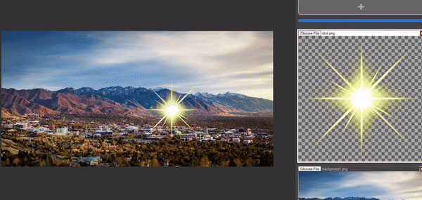

# CS4600-IntroToCG

This course teaches the fundamental computational techniques in computer graphics. It is a project-based course in which students learn about and implement various methods in modeling, animation, and rendering techniques.
based on **Steve Marschner & Peter Shirley, Fundamentals of Computer Graphics, 4th edition.**

### Projects:

##### Project #1:

A minimal compositing software works in WebGL. Allows for basic blending of various photos. Adjust the alpha channel for each foreground layer. The selected foreground picture layer can be moved.

